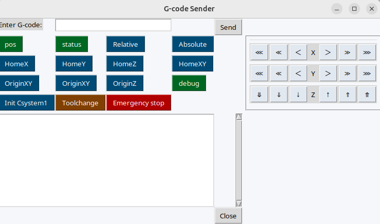

# gcodeui
A UI to simplify sending common G-code commands to your 3D printer or CNC controllers, offering a lightweight serial console with customizable command presets.



## Features
- Button-driven macros sourced from `config.yaml` for common positioning, status, and safety commands
- Live serial monitor with automatic scrollback to inspect firmware responses in real time
- Runtime overrides for port and baud rate to simplify switching between machines or profiles

## Quick Start
1. Ensure Python 3.7+ is installed.
2. Create and activate a virtual environment:
   ```bash
   python -m venv .venv
   source .venv/bin/activate
   ```
3. Install the package:
   ```bash
   pip install .
   ```
4. (Optional) Seed the user config and then edit it to your needs:
   ```bash
   gcodeui --init
   ```
5. Connect your controller (default `/dev/ttyUSB0` on Linux) and launch the UI:
   ```bash
   gcodeui
   ```
   or provide overrides:
   ```bash
   gcodeui --cfg config.yaml --port /dev/ttyUSB0 --baud 115200
   ```

## Project Layout
- `gcodeui/__init__.py` – Tkinter interface, serial I/O loop, and command dispatch logic
- `config.yaml` – default serial settings and button definitions (titles, G-code, colors)
- `requriements.txt` – runtime and development dependencies (Tk, PySerial, YAML, logging)
- `AGENTS.md` – contributor workflow and coding standards

## Configuration
Update `config.yaml` to tailor the UI for your machine:
- `gcodeui --init` seeds `~/.config/gcodeui/config.yaml` (or the platform equivalent) with the bundled template.
- `port`, `baud`: default connection parameters when the app starts
- `commands`: list of button definitions with `title`, `command` (`str` or list for macros), and optional `color` hex value
Restart the app after editing the file to reload presets. You can also override `--cfg` to point at alternative profiles or to initialize a config in a custom location (`gcodeui --init --cfg ./my-printer.yaml`).

Follow the example in the default `config.yaml`.

## Troubleshooting
- Permission denied on serial port: add your user to the `dialout` (Linux) or `uucp` (macOS) group and reconnect.
- Port not detected: verify the device with `dmesg | tail` (Linux) or `ls /dev/tty.*` (macOS) before launching the app.
- Frozen UI: check the terminal logs for connection errors and confirm no other program is holding the port.

## Contributing
See `AGENTS.md` for coding style, testing expectations, and pull-request guidelines. Please include screenshots or terminal captures when changing the UI or serial logging behavior.

## License
This project is licensed under the MIT License. See `LICENSE` for details.

## Changelog
- 2023-10-14 – Created
